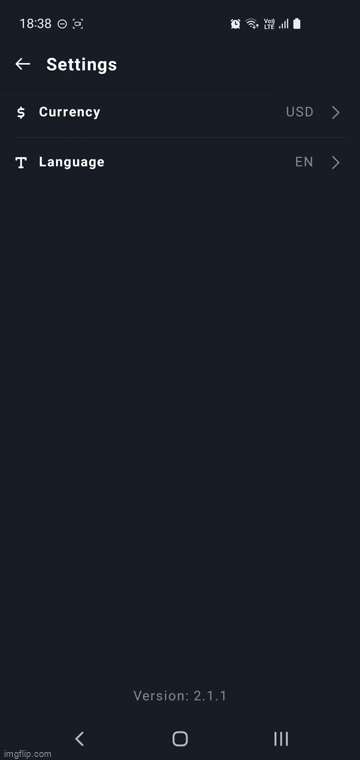

<h1 align="center">Crypto Market</h1>
<h4 align="center">A cryptocurrency tracking app that implemented with Jetpack Compose</h1>

 

## Screenshots

## Technologies

- [Kotlin](https://kotlinlang.org/) - %100 Kotlin
- [Jetpack Compose](https://developer.android.com/jetpack/compose)
- [Dagger Hilt](https://developer.android.com/training/dependency-injection/hilt-android) (Dependency Injection)
- [MVVM](https://developer.android.com/topic/libraries/architecture/viewmodel) (Android viewModel)
- [Coil](https://github.com/coil-kt/coil) (Image loading)
- [Coroutines](https://github.com/Kotlin/kotlinx.coroutines) (asynchronous operations)
- [Flow](https://kotlin.github.io/kotlinx.coroutines/kotlinx-coroutines-core/kotlinx.coroutines.flow/-state-flow/)
- [ViewModel](https://developer.android.com/topic/libraries/architecture/viewmodel)
- [OkHttp](https://github.com/square/okhttp) and [Retrofit](https://github.com/square/retrofit) (network operations)
- [CoinGecko](https://www.coingecko.com/en/api) (APIs)
